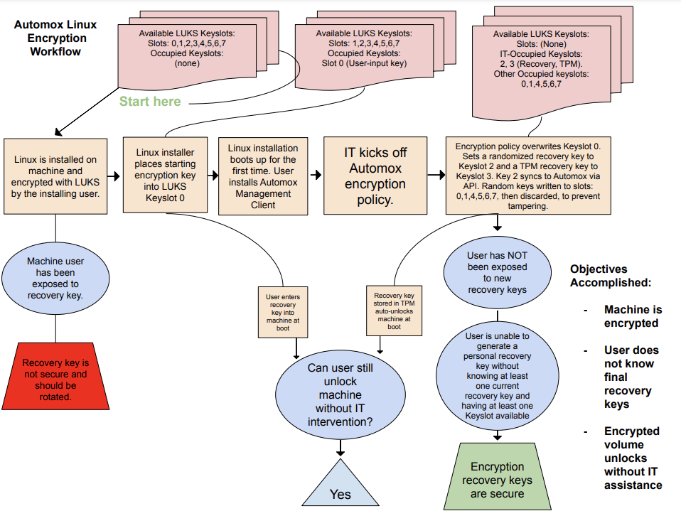

Note: Much of this readme content can also be found from within the script header itself. 
This project is licensed using a 3-Clause BSD License (found at the top of the script file and as a separate license file).

## Purpose of this script:
This script was developed by [Mapbox](https://www.mapbox.com/) IT in order to have a single script to implement, backup, and rotate encryption keys for Linux endpoints.
It also provides a platform to lock an endpoint in the event it is lost or stolen.
The final product aims to feel as seamless to users as macOS FileVault or Windows 10 Bitlocker.
This script is designed to be deployed via Automox and utilizes the Automox API for encryption key backups and rotations. However, it should be able to be re-factored to support any other Linux configuration management system.

High-level conceptual diagram:



## Components used:
- [LUKS (Linux Encryption Standard)](https://gitlab.com/cryptsetup/cryptsetup/)
- [Clevis (Handles encryption implementation across different Linux distributions)](https://github.com/latchset/clevis)
- [Automox (Endpoint Configuration Tool - Where keys are backed up to and recalled from via the Automox API)](https://www.automox.com/)

## Requirements:
- You must encrypt your Linux volume using LUKS encryption _before_ running this script. This is normally done during the Ubuntu OS installer setup wizard.
- You must include 4 files as dependencies in your Automox encryption policy (listed below). These include your encryption passphrase key in an encrypted format, your API tokens, and your encrypted passphrase files that are used to decrypt these files.
- Provide the name of your default automox server group id in the variable " default_automox_server_group_id='' "
- Your Automox policy will contain both evaluation code and remediation code. 
The evaluation code should look something like the following so that it always triggers the remediation code:
```
#!/bin/bash

exit 1
```


### These files should be uploaded as dependencies into your automox policy. Doing this causes them to be stored in the same directory as the executing script once they are downloaded onto an endpoint
This script assumes you have your api credentials and encryption passphrase encrypted as hidden files with the following names:
#.atmxapicredenc (Automox API Credentials - Encrypted)
#.atmxapicredkey (Automox API Credentials - Encryption passphrase)
#.psphrsencstring (Encryption passphrase string used to decrypt the encryption passphrase key)
#.psphrskey (Encryption passphrase key - encrypted)

### Example of one way of how to encrypt credentials for your hidden file dependencies:
echo 'encryption_password_used_during_OS_installation' | openssl enc -base64 -aes-256-cbc -pbkdf2 -salt -pass pass:encryption_signing_password

## High level concept of the script:
The idea of this script is to keep the endpoint users from knowing any of their encryption tokens (aside from the initial encryption key... unless IT performs the initial encryption steps as well).
IT or the end-user may setup their own machine, thereby bootstrapping themselves into the start of the encryption process.
However, once this script runs, it removes that initial token, replacing it with one key stored on the volume and one key stored in the TPM.
The encryption key on the volume is backed up to Automox, and is never exposed to the end user.
The TPM encryption key is also never exposed to the end user. Since the volume key is already backed up, it is unnecessary to also back up the TPM key. (This also allows the script to forego the additional complexities of uploading a file's contents via an API call.)
From this point onwards, the endpoint user is unaware of any encryption token values.
Only in the event that the user must input a recovery key (after the laptop is lost or stolen) will a user be exposed to an organizational encryption key. In this event, IT should work quickly to re-run this script and rotate that encryption key.

## How the lock process works:
In the event a laptop is lost or stolen, the TPM is cleared, erasing the encryption key stored in the TPM.

## Automox security:
Automox randomizes the directory name of the directory it deploys this script and its associated dependencies to.
The directory, which requires altering permissions for regular users to view, is deleted once the script is done executing.

## Additional context:
This script does not initially encrypt the volume. The volume initial LUKS encryption is taken care of via the Ubuntu OS intial installation setup wizard.

## Tips:
After this script runs successfully, each subsequent reboot will cause the Lenovo to lag for about 10-15 seconds before the OS login screen appears. This is when the encryption key is being read from the TPM, so a slight delay is normal.

## Tested on:
Operating Systems:
- Ubuntu 20.04 LTS, Ubuntu 20.04.2 LTS
Hardware:
  - Manufactuer:
    - Lenovo, Dell, Acer
  - Models:
    - Lenovo ThinkPad P15 Gen 1
    - Lenovo ThinkPad P53
    - Lenovo IdeaPad Duet 3
    - Lenovo ThinkPad T14 Gen 1
    - Lenovo V530-24ICB AIO
    - Lenovo ThinkPad T15 Gen 1
    - Dell XPS 9570
    - Acer Predator PH317-52-78X1
    - Lenovo X1 20QD
    - Lenovo P1 20QT

# Other sources referenced:
- [luks key information](https://www.thegeekstuff.com/2016/03/cryptsetup-lukskey/) 
- [how to setup lukscrypt add keys automatically with no user interaction](https://blog.sleeplessbeastie.eu/2019/02/20/how-to-non-interactively-manage-luks-passphrases/)
- [security implementation information](https://access.redhat.com/solutions/230993)
- [clevis walkthrough info](https://blog.dowhile0.org/2017/10/18/automatic-luks-volumes-unlocking-using-a-tpm2-chip/)
- [passphrase encryption source](http://www.cyberkeeda.com/2017/06/how-to-use-encrypted-password-in-bash.html)

## Additional Info:
LUKS Key Slot info (What key slot numbers are used through the script lifecycle)
- Initial LUKS encryption key from OS setup (gets erased) - keyslot 0
- Recovery key - keyslot 2
- TPM - keyslot 3
